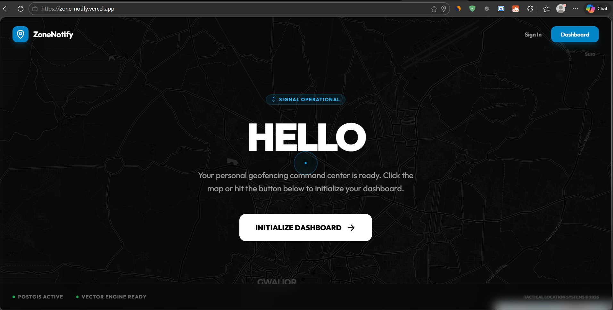
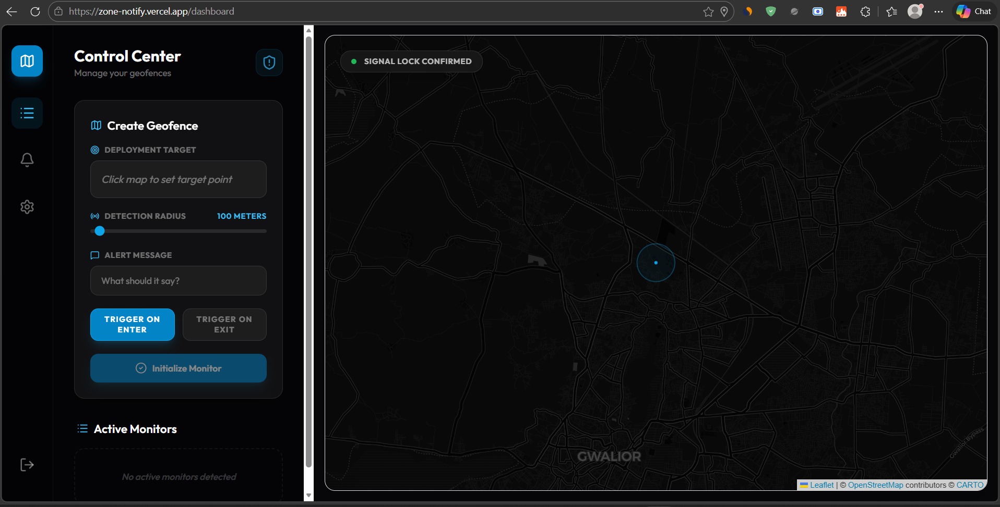

# ZoneNotify 📡📍

> **Precision Geofencing & Tactical Reminder System**

ZoneNotify is a premium, full-stack application designed for high-accuracy location-based reminders. Built with a "Command Center" aesthetic, it leverages **PostGIS** for centimeter-perfect geofencing and **Native Web Push** for real-time alerts.



## 🚀 Core Features

- **Immersive Landing Page**: Dynamic, full-screen map background that locks onto the user's GPS in real-time.
- **Tactical Dashboard**: A centralized "Control Center" for creating, monitoring, and deleting geofence zones.
- **Precision Geofences**: Interactive map selection with a radius slider (10m to 1000m accuracy).
- **Native Web Push**: Real-time ENTER/EXIT notifications delivered via a background Service Worker.
- **Responsive Interface**: Optimized for Desktop and Mobile with a specialized split-screen dashboard for operatives on the move.

## 🛠️ Technical Stack

- **Framework**: [Next.js 15](https://nextjs.org/) (App Router)
- **Database**: [PostgreSQL](https://www.postgresql.org/) + [PostGIS](https://postgis.net/) (via [Supabase](https://supabase.com/))
- **ORM**: [Prisma](https://www.prisma.io/)
- **Styling**: [Tailwind CSS](https://tailwindcss.com/) (Premium Dark Theme/Glassmorphism)
- **Animations**: [Framer Motion](https://www.framer.com/motion/)
- **Maps**: [Leaflet](https://leafletjs.com/) (CartoDB Dark Matter)
- **Notifications**: Web Push API + Service Workers

## 🔗 Live url

https://zone-notify.vercel.app/

## 📸 Screenshots

| Landing Page | Dashboard (Monitor) |
| :---: | :---: |
|  |  |


## ⚙️ Setup & Installation

### 1. Prerequisites
- **Node.js** v20+
- **PostgreSQL** with **PostGIS** extension enabled.

### 2. Configure Environment Variables
Create a `.env.local` file in the root:
```env
DATABASE_URL="your_postgresql_connection_string"
DIRECT_URL="your_direct_connection_string"
JWT_SECRET="your_secure_jwt_secret"
NEXT_PUBLIC_VAPID_PUBLIC_KEY="your_vapid_public_key"
VAPID_PRIVATE_KEY="your_vapid_private_key"
NEXT_PUBLIC_BASE_URL="http://localhost:3000"
```

### 3. Initialize Database
```bash
npx prisma db push
```

### 4. Run Development Server
```bash
npm install
npm run dev
```

## 🛡️ Tactical Engineering
The system utilizes advanced SQL queries like `ST_DistanceSphere` to calculate distance between user coordinates and reminder centers on the server-side, ensuring minimal client-side overhead and maximum battery efficiency for mobile devices.

---
*Built for precision. Designed for style.*
